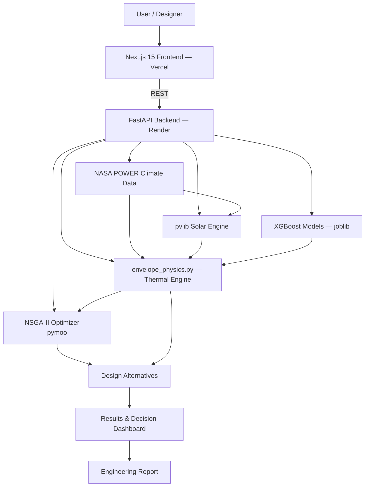

# Thermaform
### Area-Specific Passive Shelter Design Platform for High-Altitude Cold Regions

> **Smart India Hackathon 2026 — Problem Statement 26051**
> *Software Based Model Development for Design of Area Specific Shelter for Thermal Comfort Maintenance*

Thermaform is a web-based engineering platform for designing and evaluating **passive shelters for extreme cold climates**, built around the Ladakh region.

It combines **location-specific climate data, solar radiation modelling, material physics, machine learning, and multi-objective optimization** to help a designer understand how a shelter will actually perform — before a single wall is built.

Instead of testing one predefined shelter design, Thermaform lets a user vary **material, insulation, glazing, geometry, and orientation**, and compares the resulting thermal comfort and heating demand across designs for a chosen location.

---


## 1. The Problem

In high-altitude cold regions like Ladakh, keeping a shelter thermally comfortable is hard for a specific physical reason.

Daytime solar radiation is intense enough to warm an enclosed space significantly. But after sunset, indoor temperature can fall rapidly toward outdoor temperature because of heat loss through:

- Walls and roof (conduction)
- Windows and openings (glazing loss)
- Air leakage (infiltration)
- Insufficient thermal mass to buffer day–night swings
- Material and geometry choices made without reference to local climate

A shelter designed without its **specific local climate** in mind ends up depending on external heating — which in Ladakh usually means fossil fuels, trucked-in fuel, or a diesel generator running through the night.

**The SIH ask, restated:** move from generic shelter design to *area-specific* passive design — using real local climate data and appropriate envelope materials — so that thermal comfort is maintained with minimum external energy input.

---

## 2. Our Solution

Thermaform turns shelter design into a **climate-driven, simulation-based decision process** rather than a rule-of-thumb one.

```
Location
   ↓
Local Climate Data (NASA POWER)
   ↓
Solar Radiation Analysis (pvlib)
   ↓
Material & Envelope Selection
   ↓
Transient Thermal Simulation
   ↓
Heat Flow Breakdown
   ↓
Design Comparison
   ↓
Multi-Objective Optimization (NSGA-II)
   ↓
Recommended Design
```

The output is not a single predicted temperature. Thermaform is built to answer:

> **"For this exact location and climate, which shelter configuration gives better thermal comfort at lower heating demand — and what does that trade-off actually look like?"**

---

## 3. What the Platform Delivers

This maps directly onto the three outputs the problem statement asks for.

### Shelter Indoor Temperature
Predicts indoor temperature response from location, outdoor conditions, solar gain, wind, thermal mass, insulation, glazing, and material choice — plotted against outdoor temperature over the simulated period, so comfort gaps are visible, not just a final number.

### Solar Thermal Energy
Solar position and irradiance are computed for the selected location and shelter orientation using **pvlib**, then converted into estimated solar energy captured through roof, walls, and glazed surfaces — quantifying how much of Ladakh's high solar resource the design is actually able to use for passive heating.

### Heat Flow
Breaks down where the shelter gains and loses energy over time:

```
  Solar Gain
      ↓
 ┌─────────┐
 │ SHELTER │
 └─────────┘
   ↓   ↓   ↓
Walls Roof Openings
   ↓   ↓   ↓
   Heat Loss
```

The user sees heat-loss rate and indoor/outdoor differential over time, not a single aggregate figure.


---

## 4. Why Location Matters

There is no universal "best" passive shelter for cold climates. Ambient temperature, solar radiation, wind, humidity, and elevation vary sharply even within Ladakh:

```
Leh · Kargil · Nyoma · Diskit / Nubra · Drass
```

Thermaform treats **location as a design input**, not a map pin — the same shelter configuration is evaluated differently depending on where it's sited.

---

## 5. Climate Data

Location-specific meteorological and solar data is pulled from **NASA POWER**: air temperature, solar radiation, wind, humidity-related variables, and coordinates. Representative climate snapshots are cached locally so the platform stays demonstrable and reliable even without a live API round-trip during a demo.

## 6. Solar Analysis

```
Latitude / Longitude
        ↓
Solar Position
        ↓
Solar Irradiance
        ↓
Surface Orientation & Tilt
        ↓
Plane-of-Array Irradiance
        ↓
Solar Thermal Gain
```

Computed with **pvlib**, accounting for shelter orientation, tilt, and glazing properties — important specifically because solar gain is Ladakh's primary passive heating resource.

## 7. Thermal Model

The shelter is modelled as a transient thermal system — heat is gained and lost continuously, not solved as a static snapshot:

```
C · dT_in/dt = Solar Gain + Internal Gain − Conduction Loss − Infiltration Loss − Radiative Loss
```

Envelope behaviour is represented with thermal resistance and capacitance:

```
R = L / (k · A)        C = ρ · cp · V
```

| Symbol | Meaning |
|---|---|
| R | Thermal resistance |
| L | Material thickness |
| k | Thermal conductivity |
| A | Surface area |
| C | Thermal capacitance |
| ρ | Material density |
| cp | Specific heat |
| V | Material volume |

This shared physics logic (`envelope_physics.py`) is used by **both** the heat-flow router and the optimizer's objective function, so the number a user sees on the heat-flow dashboard and the number the optimizer is minimizing are guaranteed to be the same calculation — not two divergent estimates.

**Comfort threshold:** grounded in **ISHRAE IMAC / NBC 2016** (19.6°C lower bound), not the ASHRAE 55 default most student projects reach for — deliberately chosen because it reflects Indian adaptive comfort standards rather than a Western climate baseline.

## 8. Materials & Envelope Design

Comparable design parameters: wall material, wall thickness, insulation, thermal mass, glazing ratio, shelter volume, orientation, geometry.

Material costs are grounded in real published rates — **UT Ladakh Schedule of Rates (LSoR) 2024** — not assumed figures:

| Material | Cost (₹/m³) |
|---|---|
| Rammed Earth | 2,000 |
| Mud Brick | 3,000 |
| Stone | 5,250 |
| Concrete | 8,250 |

The goal isn't finding the material with the lowest thermal conductivity in isolation — it's balancing **thermal performance + thermal mass + glazing + geometry + construction cost**, because that's the actual design problem.

## 9. Machine Learning — Used Honestly

Three models were trained offline in Jupyter notebooks and exported via `joblib`:

- Envelope/design classifier
- Indoor temperature regressor
- Thermal energy (heating demand) regressor

All three are **XGBoost** models, served (not retrained) by the FastAPI backend at inference time. ML gives fast recommendations and predictions; the pvlib solar model and the physics-based thermal model provide the engineering interpretation underneath those predictions. Thermaform does not claim ML replaces thermal engineering — it uses ML where it's fast and physics where it's necessary for correctness, and is explicit about which is which.

## 10. Multi-Objective Optimization

Increasing insulation or improving glazing reduces heating demand but raises construction cost — there is no single optimum. Thermaform uses **NSGA-II** (via `pymoo`) to explore that trade-off directly, optimizing for:

- Lower heating demand
- Better thermal comfort
- Lower construction cost

The output is a **Pareto frontier**, not one arbitrary "best" answer — the designer picks the point on the frontier that matches their project's priorities (cheapest viable, warmest, or balanced).

## 11. 3D Shelter Visualization

A parametric, **flat-roof, Ladakh-appropriate** 3D model (react-three-fiber) is generated from the same design parameters — volume, wall height, wall thickness, glazing, orientation — used to communicate the proposed design. The thermal calculations are driven by the underlying numerical geometry, not the render; the 3D view exists to make the design legible to a non-technical stakeholder or judge.

---

## 12. Platform Workflow

| Step | Action |
|---|---|
| 1 | Select region (Leh, Kargil, Nyoma, Nubra, or custom coordinates) |
| 2 | Load climate conditions for that region |
| 3 | Define shelter: volume, geometry, material, thickness, insulation, glazing, thermal mass |
| 4 | Evaluate indoor temperature response and identify comfort gaps |
| 5 | Analyse solar gain by surface |
| 6 | Analyse heat flow / loss by envelope component |
| 7 | Compare alternative material/envelope combinations under identical climate |
| 8 | Run NSGA-II optimization for cost-vs-performance trade-offs |
| 9 | Select the design matching project constraints |
| 10 | Export results as an engineering-oriented report |


## 13. Key Engineering Outputs

| Output | Purpose |
|---|---|
| Indoor Temperature | Thermal comfort behaviour over time |
| Outdoor Temperature | Climatic boundary condition |
| Solar Gain | Passive solar contribution |
| Heat Loss | Where energy is escaping |
| Heating Demand | External energy required |
| Envelope U-value | Envelope heat-transfer performance |
| Hours Below Comfort (19.6°C) | Discomfort periods, ISHRAE IMAC basis |
| Construction Cost | LSoR 2024–grounded economic trade-off |
| Pareto Designs | Competing design solutions |
| 3D Shelter | Communicating the selected design |

---

## 14. System Architecture



Frontend and backend are deployed as **separate services** — Next.js on Vercel, FastAPI on Render — communicating over REST. This keeps the Python scientific stack (pvlib, pymoo, XGBoost) on infrastructure suited to it, rather than forcing everything into a single serverless function.

## 15. Technology Stack

**Frontend** — Next.js 15, TypeScript, Tailwind CSS, shadcn/ui, react-three-fiber, Recharts
**Backend** — Python, FastAPI, Pydantic
**Scientific computing** — NumPy, Pandas, SciPy, pvlib
**Machine learning** — XGBoost, scikit-learn, joblib
**Optimization** — pymoo (NSGA-II)
**External data** — NASA POWER
**Deployment** — Vercel (frontend) + Render (backend)

**Design system:** warm cream/beige palette (background ≈ `#F6F1E7`, terracotta accent ≈ `#B65C38`), Fraunces serif for display type, Public Sans for body text, JetBrains Mono for data/numeric output — chosen to read as an earthy, physical-materials tool rather than a generic SaaS dashboard.

---

## 16. Local Development

### Requirements
Node.js 18+, Python 3.10+, Git

### Backend
```bash
cd backend
python -m venv venv
source venv/bin/activate      # Windows: venv\Scripts\activate
pip install -r requirements.txt
uvicorn main:app --reload --port 8000
```
API: `http://localhost:8000` · Docs: `http://localhost:8000/docs` · Health: `http://localhost:8000/health`

### Frontend
```bash
cd frontend
npm install
npm run dev
```
App: `http://localhost:3000`

---

## 17. Alignment with SIH 26051

| SIH Requirement | Thermaform Implementation |
|---|---|
| Area-specific shelter design | Location-driven climate and solar inputs |
| User-defined values | Configurable shelter and material parameters |
| Collected atmospheric data | NASA POWER climate integration |
| Suitable materials | LSoR 2024–costed material comparison |
| Thermal mass | Thermal capacitance in the physics model |
| Composite/multi-material envelope | Layered thermal resistance representation |
| Effect of openings | Glazing ratio and opening parameters |
| Size and shape | Parametric shelter geometry |
| Orientation | Solar position and surface orientation |
| Inside temperature prediction | XGBoost indoor temperature model |
| Solar thermal energy | pvlib irradiance and passive gain analysis |
| Heat flow over time | Transient, shared-physics heat-flow engine |
| Comparative analysis | Side-by-side design evaluation |
| Efficient combination | NSGA-II multi-objective optimization |
| Reduced energy utilization | Heating-demand minimization objective |
| Passive thermal comfort | Envelope + solar + thermal-mass strategy, ISHRAE IMAC threshold |

---

## 18. Scope and Honesty About Limits

Thermaform is an **engineering decision-support prototype**, not a substitute for CFD validation, structural certification, or field-measured calibration. ML predictions are used for fast design exploration; the pvlib and physics-based thermal calculations provide the interpretable engineering layer underneath them. For production use, models should be validated against measured shelter data and calibrated to specific construction practices per region.

The current prototype targets high-altitude cold-climate shelters, with Ladakh as the demonstration region. The architecture generalizes to other cold climates by swapping location, climate data, and material properties — Ladakh is the proof of concept, not a hard boundary.

---

## Vision

High-altitude communities shouldn't have to depend entirely on active heating to stay warm. Thermaform's premise is that the building envelope itself should do most of that work — by matching local climate data, passive solar design, appropriate materials, thermal mass, and optimization to the specific place a shelter will actually sit.

**Design for the climate. Capture the sun. Reduce heat loss. Minimize external energy.**
