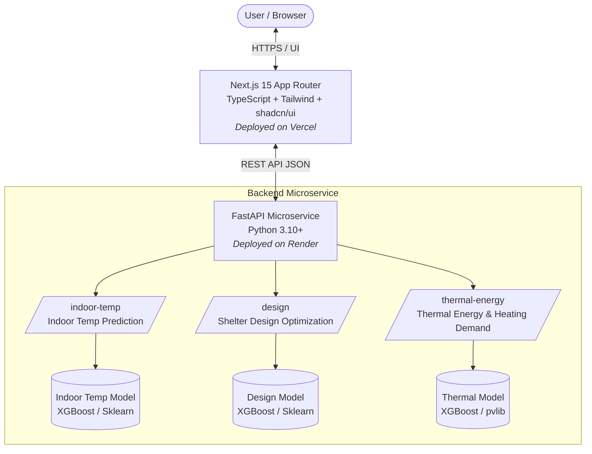

# SIH 2026: Cold-Climate Shelter Thermal Comfort Design Platform

Software-based model development for the design of area-specific passive shelters for thermal comfort maintenance in extreme high-altitude cold climates (Ladakh region). This platform leverages machine learning models trained on atmospheric, solar irradiance, and shelter material datasets to optimize design parameters, predict indoor temperatures, and estimate thermal energy / heating demand without requiring fossil-fuel-intensive active heating.

Reference Problem Statement: *Software Based Model Development for Design of Area Specific Shelter for Thermal Comfort Maintenance (SIH 26051)*.

---

## Architecture Overview



---

## Project Structure

```text
SIH_26051/
├── README.md                                # Project documentation and setup guide
├── .gitignore                               # Root gitignore for frontend and backend
├── frontend/                                # Next.js 15 frontend application
│   ├── src/
│   │   ├── app/                             # Next.js App Router
│   │   │   ├── layout.tsx                   # Dark theme root layout & JetBrains Mono font
│   │   │   ├── page.tsx                     # Homepage navigation cards
│   │   │   ├── globals.css                  # Semantic tokens & sharp corner styles
│   │   │   ├── indoor-temp/page.tsx         # Route: Indoor Temperature Prediction
│   │   │   ├── design/page.tsx              # Route: Shelter Design Optimization
│   │   │   └── thermal-energy/page.tsx      # Route: Thermal Energy Model
│   │   ├── components/ui/                   # UI components (shadcn/ui)
│   │   └── lib/utils.ts                     # Utility helpers
│   ├── .env.local.example                   # Frontend environment configuration template
│   └── package.json                         # Frontend dependencies and scripts
└── backend/                                 # FastAPI microservice
    ├── main.py                              # FastAPI application & CORS configuration
    ├── requirements.txt                     # Backend Python dependencies
    ├── .env.example                         # Backend environment configuration template
    ├── models/                              # Serialized model artifact directory (.pkl / .joblib)
    ├── routers/                             # Prediction API route handlers
    │   ├── indoor_temp.py                   # Indoor temperature prediction router
    │   ├── design.py                        # Shelter design prediction router
    │   └── thermal_energy.py                # Thermal energy & demand router
    └── schemas/                             # Pydantic request/response schemas
        ├── indoor_temp.py
        ├── design.py
        └── thermal_energy.py
```

---

## Local Development Setup

### Prerequisites
- **Node.js**: v18.17+ or v20+ (Node v24 supported) & npm
- **Python**: 3.10+ & pip

---

### 1. Backend (FastAPI Microservice)

```bash
# Navigate to backend directory
cd backend

# Create and activate a virtual environment
python -m venv venv
# On Windows:
venv\Scripts\activate
# On Linux/macOS:
source venv/bin/activate

# Install dependencies
pip install -r requirements.txt

# Configure environment variables
cp .env.example .env

# Run FastAPI development server
uvicorn main:app --reload --port 8000
```

The backend will be live at:
- **API**: [http://localhost:8000](http://localhost:8000)
- **Interactive Swagger Docs**: [http://localhost:8000/docs](http://localhost:8000/docs)
- **Health Check**: [http://localhost:8000/health](http://localhost:8000/health)

---

### 2. Frontend (Next.js 15 App)

```bash
# Open a new terminal and navigate to frontend directory
cd frontend

# Install dependencies
npm install

# Configure environment variables
cp .env.local.example .env.local

# Run Next.js development server
npm run dev
```

The frontend will be accessible at [http://localhost:3000](http://localhost:3000).

---

## Design System Tokens
- **Theme**: Dark theme by default.
- **Corners**: Sharp aesthetics (`rounded-none` / `rounded-sm`).
- **Typography**: Clean sans body with `JetBrains Mono` for numeric metrics and telemetry values.
- **Semantic Colors**: Tailwind tokens for `success`, `warning`, `danger`, and `accent`.
